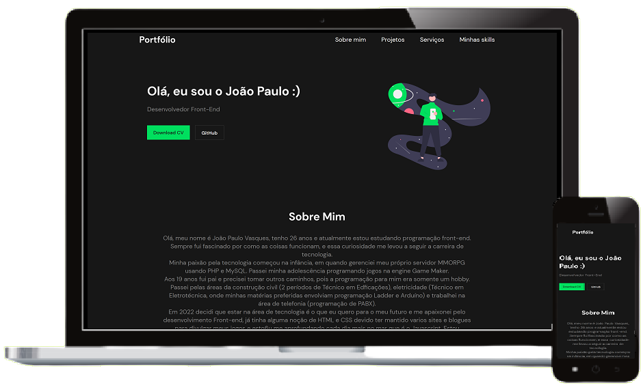

<h1 align="center">
  Portfolio
</h1>

  

 

&nbsp;
 &nbsp;
 

 

# 📰 Description / Descrição

🇺🇸 - Portfolio based on a Codelândia channel project, from <a href="https://iuricode.com/">Iuri Silva</a>.

 
🇧🇷 - Portfólio do baseado em um projeto do canal Codelândia,  do <a href="https://iuricode.com/">Iuri Silva</a>.

 

# 👷🔧 Built With / Construído Com

🇺🇸 - This project was built using these technologies: 
🇧🇷 - Este Projeto foi construído utilizando essas tecnologias:
- HTML5
- CSS3
- Javascript

 

# 📋 Figma
https://www.figma.com/file/Yb9IBH56g7T1hdIyZ3BMNO/Desafios---Codel%C3%A2ndia?node-id=13190%3A2&t=4duhLBX6LnHX0Hby-0

# 

